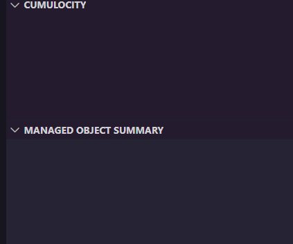
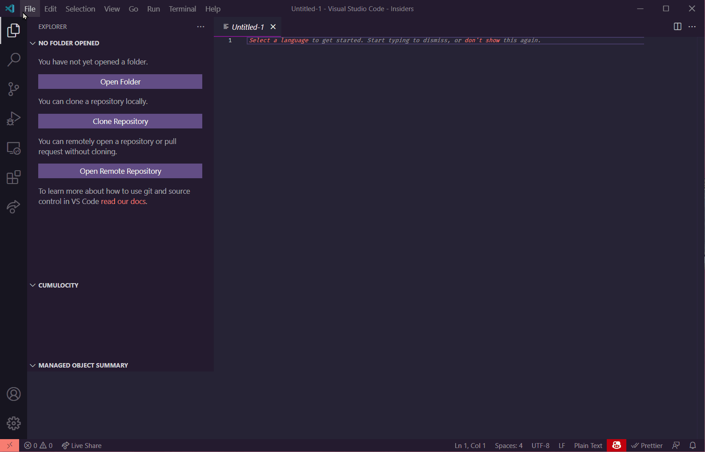
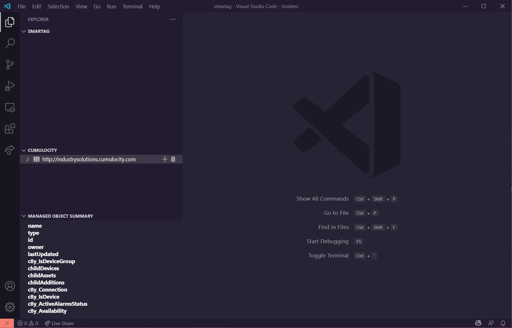

<!-- @format -->

# cumulocity-helper extension to aid development

## Feature Summary

-   Display Managed objects and hierarchy from multiple tenants
    -   credentials stored securely using vscode secrets
    -   per workspace and persistant
-   Open Managed objects in the editor (read-only currently)
-   Create and scaffold a Cumulocity widget project supporting both standard and runtime widgets

## installing

go to extensions , search for `cumulocity-helper` in the search bar and click install.

## Usage

### viewing tenants

Once enabled the wil be 2 views shown under the explorer

these are initially empty. When you mouse over the title of the `cumulocity` view you should see some icons.

> N.B the `+` operation will store the tenant details with the current workspace. So please ensure that you are in the workspace you want the view to display in.

Use the `+` icon to add a new tenant to the view. Clicking this will bring up some prompts at the top of the screen. The image below shows the whole process.

You can then navigate through the tree

### Create and Scaffold widget

right click in the explorer view and select `create widget`. vscode will start the process of creating and scaffolding the widget as below. Note that sections of the following gif are sped up and this process can take a while to complete depending upon network and computer speed.

> N.B. the widget directory will be placed within the chosen workspace or directory.

Once you have done the install the widget is fully working and you can either use the npm interface in the UI, or the command line

-   Use the `npm run start` ( runs `c8ycli server` )

> N.B. the buld and deploy options generated by the `c8ycli` when the project is created are there also.

-   build a runtime widget `npm run buildRuntime`

